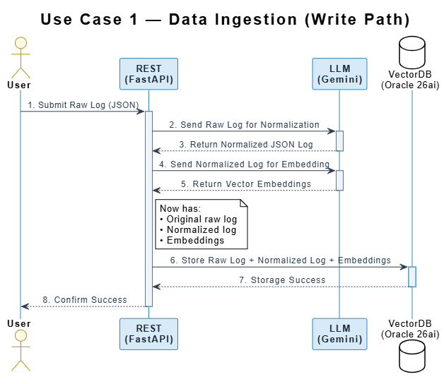
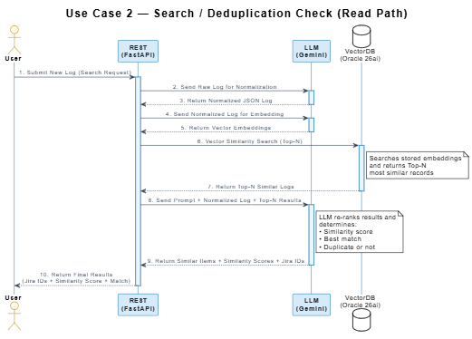

# Log Normalization — Problem Statement & Proposal

> **Version:** 0.1 — Draft for SME Review  
> **Scope:** Based on analysis of 8 error log files only. Non-error logs not yet analyzed.

---

## Table of Contents

1. [Problem Statement](#1-problem-statement)
2. [System Overview](#2-system-overview)
3. [Log Structure — What We Observed](#3-log-structure--what-we-observed)
4. [Object Type Classification](#4-object-type-classification)
5. [Signal vs Noise](#5-signal-vs-noise)
6. [Error Detail — Field Inventory](#6-error-detail--field-inventory)
7. [Normalization Strategy](#7-normalization-strategy)
8. [Normalized Schema — Example Output](#8-normalized-schema--example-output)
9. [Open Points for SME Review](#9-open-points-for-sme-review)
10. [Next Steps](#10-next-steps)

---

## 1. Problem Statement

Oracle ATP DB 26ai maintains a repository of reported issues with associated **Jira IDs**. When new issues are logged, there is currently **no automated mechanism** to check whether an identical or similar issue already exists.

**This causes:**
- Duplicate Jira issue creation
- Increased manual triage effort
- Inefficiencies in issue tracking and resolution

**Required capability:** Automatically process every new log, normalize its structure, and perform a semantic similarity check against historical logs — returning the matching Jira ID with a similarity score.

---

## 2. System Overview

The solution uses four components:

| Component | Technology | Role |
|---|---|---|
| User Interface | UI / Browser | Submits logs for ingestion or search |
| REST Layer | FastAPI | Orchestrates the pipelines |
| LLM | Gemini Models | Normalizes logs, generates embeddings, re-ranks results |
| Vector Database | Oracle 26ai | Stores raw logs, normalized logs, and vector embeddings |

### Pipeline 1 — Data Ingestion (Write Path)


### Pipeline 2 — Search / Deduplication Check (Read Path)


---

## 3. Log Structure — What We Observed

> **SME Note:** Please validate or correct any observation in this section.

Each log file is a **valid JSON array of event objects**. A single log file represents one workflow execution.

**Key characteristics:**

- Files contain between **3 and 60 objects** depending on the workflow
- Object structure is **NOT uniform** — keys differ across objects within the same file and across different files
- Objects are **linked to each other** via `eventId` and `parentEventId`, forming a sequential event chain
- The log tells a story: it starts with the workflow trigger and ends at the point of failure (for error logs)

**Example event chain (simplified):**

```
Object 1  → serviceInstanceId only         (identifies which OIC instance)
Object 2  → automationRoot: true, flowCode (the workflow that was triggered)
Object 3  → variables: [...]               (business tracking variables)
Objects 4–12 → actionType, milestone       (execution steps — what happened inside)
Object 13 → errorState, errorId            (error was detected)
Object 14 → endpointName, operationName    (which endpoint was being called)
Object 15 → errorCode, errorMessage, ...   (full error details)
```

Each object is linked to the previous via `parentEventId → eventId`.

---

## 4. Object Type Classification

By inspecting the **key signature** of each object, we can classify every object into one of 11 types:

| Object Type | How to Identify (Key Signature) | Count Across 8 Files |
|---|---|---|
| `SERVICE_CONTEXT` | Only key is `serviceInstanceId` | 8 (one per file) |
| `FLOW_ROOT_TRIGGER` | Contains `automationRoot: true` | 8 (one per file) |
| `VARIABLE_TRACKING` | Contains `variables` array | 9 |
| `FLOW_STEP` | Has `actionType` + `milestone`, no error/endpoint keys | 61 |
| `ENDPOINT_INVOKE_PRE` | Has `endpointName` + milestone ending in `Pre` | 42 |
| `ENDPOINT_SUCCESS` | Has `sucInvokeDurationAggr` | 35 |
| `ERROR_DETAIL` | Has `errorCode` AND `errorMessage` | 10 |
| `ERROR_STATE_MARKER` | Has `errorState` + `errorId` + `automationInstanceId` | 4 |
| `FILE_OPERATION` | Has `stageFileOperation` | 4 |
| `FLOW_STATE` | Has `flowCode` + `instanceState`, no `automationRoot` | 1 |
| `OTHER` | Does not match any above pattern | 5 |

> **SME Note:** Please review the `OTHER` category. These 5 objects did not match any known pattern and need your input to classify correctly.

---

## 5. Signal vs. Noise

Not all object types carry useful information for deduplication. After review, we classify them as:

| Object Type | Classification | Reason |
|---|---|---|
| `SERVICE_CONTEXT` | **SIGNAL** | Identifies which OIC instance generated the log |
| `FLOW_ROOT_TRIGGER` | **SIGNAL** | Identifies the workflow, trigger type, user, and timestamp |
| `VARIABLE_TRACKING` | **SIGNAL** | Contains business keys (OrderNumber, Supplier, etc.) — critical context |
| `ERROR_DETAIL` | **SIGNAL** | Contains the actual error — most important for deduplication |
| `FLOW_STEP` | NOISE | Internal execution mechanics — not relevant for matching |
| `ENDPOINT_INVOKE_PRE` | NOISE | Endpoint info is already captured in ERROR_DETAIL when failure occurs |
| `ENDPOINT_SUCCESS` | NOISE | Successful calls are not relevant for error deduplication |
| `ERROR_STATE_MARKER` | NOISE | Recovery metadata — supplementary, not a core signal |
| `FILE_OPERATION` | NOISE | File I/O steps — not relevant unless the failure occurs here |
| `FLOW_STATE` | NOISE | Lifecycle state transitions — not useful for semantic matching |
| `OTHER` | NOISE (pending SME input) | Unclassified — requires SME confirmation |

**Core extraction rule:**  
> From each log file, retain only: `SERVICE_CONTEXT` + `FLOW_ROOT_TRIGGER` + `VARIABLE_TRACKING` + `ERROR_DETAIL`  
> Discard everything else.

---

## 6. Error Detail — Field Inventory

The `ERROR_DETAIL` object is the most critical for deduplication. The following fields were found across the 8 error log files:

| Field | Present In | Description | Example Values |
|---|---|---|---|
| `errorCode` | All 8 files | Short error code | `"Execution failed"`, `"401"`, `"404"`, `"406"`, `"503"`, `"net.http.503"`, `"CA-BS-001"` |
| `errorState` | All 8 files | Numeric severity | `500` (seen in all files) |
| `errorSummary` | All 8 files | One-line summary | `"CloudInvocationException"`, `"Pure SQL Exception"`, `"ASM ICS Service request handler failed"` |
| `errorMessage` | All 8 files | Full error detail — often raw XML with HTTP status, failed URL, root cause | Long XML string — see note below |
| `errorType` | Most files | Numeric error type code | `11`, `17`, `22`, `24`, `31` — **SME input needed to decode** |
| `businessErrorName` | Most files | Fully qualified error class | `"oracle.cloud.connector.api.CloudInvocationException"`, `"{http://schemas.oracle.com/bpel/extension}remoteFault"` |
| `endpointName` | Most files | Name of the endpoint that failed | `"InvokeIntegration"`, `"CreateSupp"`, `"getNewRSD"`, `"UpdateSupplierHeader"` |
| `endpointType` | Most files | Type of endpoint | `rest`, `soap`, `erp`, `collocatedics` |
| `operationName` | Most files | HTTP method or operation | `POST`, `execute`, `create`, `submitESSJobRequest` |
| `milestone` | Most files | Step code where failure occurred | `"Ei0"`, `"Ei2"`, `"Ei9#m"`, `"Er0"`, `"eh0"` — **SME input needed to decode** |
| `errorAutoRetriable` | All 8 files | Can the error be retried automatically? | `false` in all 8 files |
| `retryCount` | All 8 files | Number of retries attempted | `0` in all 8 files |
| `errorComponentType` | Most files | Numeric component category | `1`, `2` — **SME input needed to decode** |
| `errorId` | All 8 files | Internal unique ID for the error event | UUID-style string |
| `adapterEndpointMetricsMessage` | Most files | Adapter-level metrics — contains endpoint URL, HTTP method, duration, pass/fail | `"Request: 'Create Suppliers in ERP Cloud' failed in 422 milliseconds"` |

> **SME Note on `errorMessage`:** This field contains raw XML (`APIInvocationError` format) with nested HTTP status codes, failed URLs, and error descriptions. It cannot be parsed with simple rules — this is one of the two places where LLM assistance is proposed (see Section 7).

---

## 7. Normalization Strategy

### Approach

The developer does **no local normalization**. The raw log is sent to the LLM as-is. The LLM handles all the variability of the input and returns a consistent, predictable JSON output every time.

The developer's responsibility is to define **what the LLM must return** — the output contract. The LLM figures out how to get there from whatever the input looks like.

---

### What the LLM Must Do

| Task | Description |
|---|---|
| **1. Understand the log** | Read the entire JSON array and understand the execution story — what workflow ran, who triggered it, what happened, and where it failed |
| **2. Identify the log type** | Determine whether the log represents an `error` or an `informational` execution — this drives what fields are relevant |
| **3. Extract structured output** | Produce a consistent normalized JSON regardless of how the input was structured — the schema is fixed, the LLM figures out the mapping |
| **4. Parse errorMessage** | If it is an error log, extract the human-readable root cause, HTTP status, and failed endpoint from the raw XML / HTML inside the `errorMessage` field |
| **5. Clean tracking variables** | The `variables` array uses the pattern `_Oo_VarName_Oo_ value` — the LLM strips the wrapper and returns clean key-value pairs |

---

### The One Rule to Enforce

> The LLM must **always return the same schema structure** — no extra fields, no missing fields, no restructuring based on what it finds.
> If a field has no source data in the log, return `null` — never omit the field.

This is what makes the output predictable, storable, and embeddable.

---

### The Output Contract (Target Normalized Schema)

This is what the developer defines and owns. The LLM must always return this exact structure:

```json
{
  "log_type": "error | informational",

  "flow": {
    "code":         "",
    "version":      "",
    "type":         "",
    "trigger_type": "rest | soap | scheduled",
    "operation":    "",
    "timestamp":    ""
  },

  "user": {
    "id": ""
  },

  "tracking_variables": {
    "primary_key": { "name": "", "value": "" },
    "secondary":   []
  },

  "error": {
    "code":           "",
    "state":          "",
    "summary":        "",
    "message_parsed": {
      "http_status":       "",
      "root_cause":        "",
      "failed_url":        "",
      "error_description": ""
    },
    "endpoint_name":       "",
    "endpoint_type":       "",
    "operation":           "",
    "milestone":           "",
    "retry_count":         "",
    "auto_retriable":      "",
    "business_error_name": ""
  }
}
```

> For informational logs, the `error` block must be returned as `null` — not omitted.
> This schema will be updated after non-error logs are analyzed.

---

### Responsibility Split

| Decision | Owner | Notes |
|---|---|---|
| Target normalized schema | Developer | Defined once, versioned, shared with LLM as the output contract |
| All input parsing and field mapping | LLM | LLM handles all structural variability of the source log |
| Log type classification (error vs informational) | LLM | Determined from the content and structure of the log |
| Parsing raw XML / HTML in `errorMessage` | LLM | LLM extracts structured fields from unstructured error text |
| Cleaning `_Oo_` pattern in tracking variables | LLM | LLM strips wrapper and returns clean key-value pairs |
| Prompt design and tuning | Developer | To be done in a later phase — not in scope now |

---

## 8. Normalized Schema — Example Output

Sample normalized output for an error log (file 1 — `RH_NAVAN_DAILY_INTEGR_SCHEDU`):

```json
{
  "log_type": "error",

  "flow": {
    "code":         "RH_NAVAN_DAILY_INTEGR_SCHEDU",
    "version":      "01.00.0000",
    "type":         60,
    "trigger_type": "scheduled",
    "operation":    null,
    "timestamp":    "2025-11-28T18:06:22Z"
  },

  "user": {
    "id": "venum@zelarsoft.com"
  },

  "tracking_variables": {
    "primary_key": { "name": "startTime", "value": "2025-11-28T18:06:23.071+00:00" },
    "secondary":   []
  },

  "error": {
    "code":           "Execution failed",
    "state":          500,
    "summary":        "oracle.cloud.connector.api.CloudInvocationException",
    "message_parsed": {
      "http_status":       404,
      "root_cause":        "Not Found",
      "failed_url":        "/ic/api/integration/v1/flows/rest/RH_NAVAN_TO_ATP_DAILY_INTEG/1.0/oic/navabrexrecon/",
      "error_description": "No currently active integrations serving the requested path"
    },
    "endpoint_name":       "InvokeIntegration",
    "endpoint_type":       "collocatedics",
    "operation":           "POST",
    "milestone":           "Ei0",
    "retry_count":         0,
    "auto_retriable":      false,
    "business_error_name": "oracle.cloud.connector.api.CloudInvocationException"
  }
}
```

> **SME Note:** Please verify this output looks correct for this log. This is the shape of data that will be stored in VectorDB and used for deduplication matching.

---

## 9. Open Points for SME Review

The following questions cannot be resolved by the developer without domain knowledge. **SME input is required before implementation begins.**

| # | Question | Why It Matters |
|---|---|---|
| 1 | What do the `errorType` numeric values mean? (Values seen: `11`, `17`, `22`, `24`, `31`) | Could be used to categorize errors semantically without relying on LLM interpretation |
| 2 | What does the `milestone` field encode? (Values seen: `Ei0`, `Ei2`, `Ei9#m`, `Er0`, `eh0`, `Ey0`) | Indicates where in the flow the failure occurred — important for accurate deduplication |
| 3 | What does `errorComponentType` encode? (Values seen: `1`, `2`) | May indicate inbound vs. outbound component — useful for classification |
| 4 | What defines an error log vs. an informational log structurally? | Required to build the classifier that separates error logs from info logs before normalization |
| 5 | Are there additional fields in non-error logs that should be in the normalized schema? | The schema is currently based on error logs only — non-error structure is unknown |
| 6 | What is the expected output format for similarity results? (e.g. Match / Duplicate / Percentage score) | Determines how the LLM re-ranking prompt should be structured |
| 7 | What similarity threshold should trigger automatic deduplication vs. flagging for manual review? | Needed to define the decision boundary in the search pipeline |
| 8 | Should the Jira ID be stored in VectorDB metadata or as a separate lookup table? | Affects the storage model and retrieval strategy |
| 9 | Can you confirm or correct the `OTHER` object type category? (5 unclassified objects found across 8 files) | These objects did not match any known pattern — SME input needed to classify or discard them |

---

## 10. Next Steps

| # | Action | Owner |
|---|---|---|
| 1 | SME reviews this document and provides answers to Section 9 open points | SME |
| 2 | Share non-error (informational) log file samples for structural analysis | Developer / SME |
| 3 | Update normalized schema based on non-error log analysis and SME feedback | Developer |
| 4 | Finalize object type classification rules to cover non-error object types | Developer + SME |
| 5 | Build and test the normalization module (Python) implementing Layers 1 and 2 | Developer |
| 6 | Design and test LLM prompts for Layer 3 (errorMessage parsing, variable cleaning) | Developer |
| 7 | Define embedding strategy — which fields from the normalized schema to embed | Developer + SME |

---

